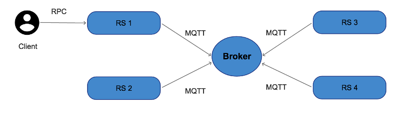

## Tugas RPC dan Message Oriented Middleware

Pada soal ini, anda diminta untuk membuat mekanisme sinkronisasi data pasien antar rumah sakit dengan menggunakan metode komunikasi antar entitas : RPC dan Message Oriented Middleware berjenis Publish-Subscribe.

### Rancangan Sistem

Rancangan sistem yang anda tawarkan dapat dilihat pada gambar di atas. Pada rancangan tersebut, terdapat beberapa entitas antara lain :

#### A. Client Rumah Sakit
Pada setiap rumah sakit terdapat entitas client dengan kebutuhan fungsional sebagai berikut :
1.	Mampu melakukan input data pasien yang meliputi : NIK (Nomor Induk Kependudukan), Nama, Alamat dan Penyakit. 
2.	Mengirimkan data inputan tersebut ke server rumah sakit lewat mekanisme RPC.
3.	Menampilkan data pasien yang diambil dari server rumah sakit.

#### B. Server Rumah Sakit
Setiap rumah sakit memiliki 1 server rumah sakit dengan kebutuhan fungsional sebagai berikut :
1.	Menerima data pasien dari client rumah sakit menggunakan RPC.
2.	Menyimpan data pasien ke sebuah struktur data map di Golang. (https://tour.golang.org/moretypes/19)
3.	Melakukan publish data pasien ke rumah sakit lain dengan protokol MQTT. Dalam posisi ini, rumah sakit lain berperan sebagai subscriber.
4.	Selain berperan sebagai server RPC dan juga publisher, server rumah sakit juga berperan sebagai subscriber yang menerima data pasien dari rumah sakit lain untuk kemudian di simpan pada struktur data map miliknya.
5.	Mengirimkan daftar pasien ke client untuk ditampilkan.

Untuk memenuhi kebutuhan tersebut, pada server terdapat beberapa remote procedure yang harus diimplementasikan :
- add_pasien(data_pasien) untuk memasukkan data pasien baru
- get_pasien() untuk melihat daftar pasien

