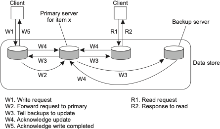

# Tugas Replikasi dan Konsistensi

Implementasikan protokol konsistensi dengan metode primary-backup pada 3 buah server dengan 1 client. Ketentuannya :
- Data pada setiap server disimpan pada sebuah list. Data akan diupdate ketika ada propagasi replika.
- Client bisa terhubung ke server manapun
- Komunikasi client-server atau server-server menggunakan metode RPC 

